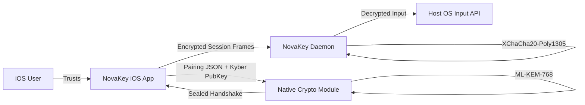

# Visual Diagram

```mermaid
flowchart LR
    User[iOS User]
    iOS[NovaKey iOS App]
    NativeCrypto[Native Crypto Module]
    Daemon[NovaKey Daemon]
    HostOS[Host OS Input API]

    User -->|Trusts| iOS

    iOS -->|Pairing JSON + Kyber PubKey| NativeCrypto
    NativeCrypto -->|ML-KEM-768| NativeCrypto
    NativeCrypto -->|Sealed Handshake| iOS

    iOS -->|Encrypted Session Frames| Daemon
    Daemon -->|ML-KEM Decaps| Daemon
    Daemon -->|HKDF-SHA256| Daemon
    Daemon -->|XChaCha20-Poly1305| Daemon
    Daemon -->|Decrypted Input| HostOS
```
