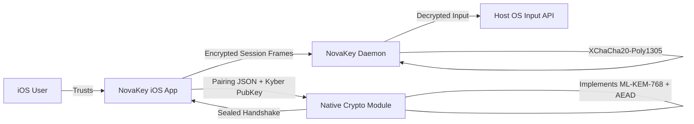

# Crypto Architecture

This document describes NovaKey’s cryptographic architecture at a conceptual level.
This diagram summarizes the iOS ↔ native crypto module ↔ daemon trust and crypto boundaries.

For a reviewer-ready overview, see:  
➡️ [Crypto Architecture One-Pager (Daemon Anchors)](NovaKey_Crypto_Architecture_OnePager_DaemonAnchors.pdf)

> **Navigation**
>
> - 🔐 [Crypto Audit Appendix (Combined, PDF)](NovaKey_Crypto_Audit_Appendix_Combined.pdf)
> - 🧠 [Threat Model Diagram (PDF)](NovaKey_Threat_Model_Diagram.pdf)
> - 📋 [iOS Crypto Traceability](CRYPTO_TRACEABILITY.md)
> - 🖥️ [Daemon Crypto Traceability](CRYPTO_TRACEABILITY_DAEMON.md)
> - 🧪 [Security Test Plan](SECURITY_TEST_PLAN.md)
> - 🧾 [Crypto Architecture One-Pager (Daemon Anchors, PDF)](NovaKey_Crypto_Architecture_OnePager_DaemonAnchors.pdf)

## Visual Diagram

---

**See also**
- [Crypto Appendix (Formal)](CRYPTO_APPENDIX.md)
- [Threat Model Diagram](NovaKey_Threat_Model_Diagram.pdf)

